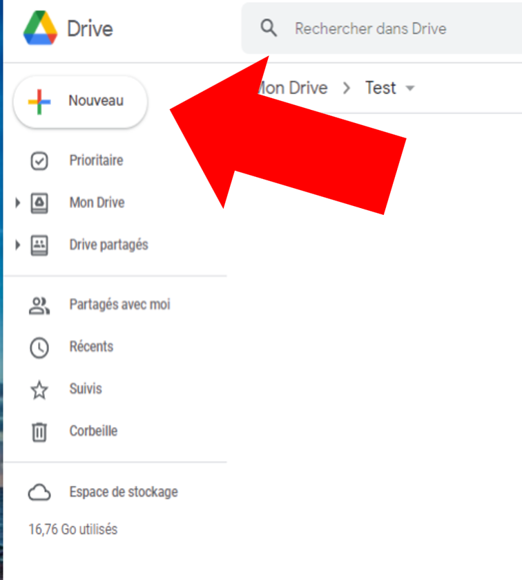
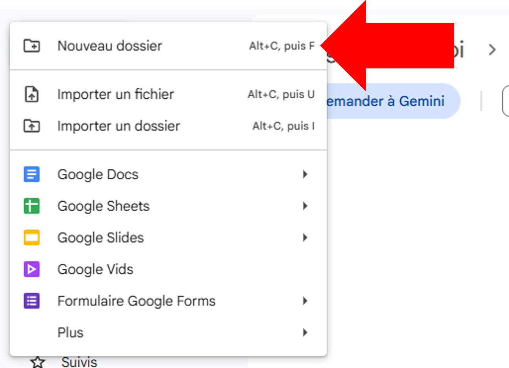
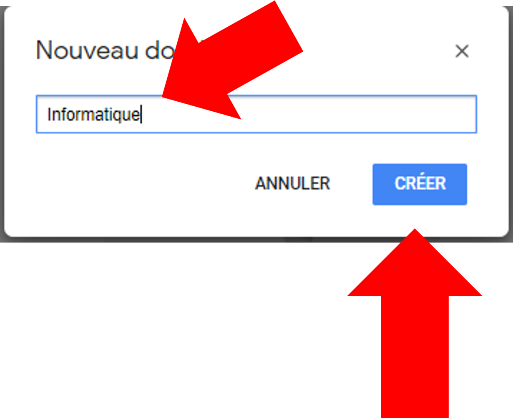

Un dossier, dans le Drive, c'est exactement la même idée qu'une pochette
dans un sac d'école : ça sert à ce que les feuilles ne se promènent pas
toutes seules. La manipulation prend quatre clics, et c'est la première
chose à savoir faire dans le Drive.

## 1. Se placer au bon endroit

Ouvre **Google Drive**, puis choisis d'abord *où* le dossier doit être créé :

- pour un dossier au premier niveau, clique sur **Mon Drive** dans le menu
  de gauche ;
- pour un dossier **à l'intérieur** d'un autre dossier, ouvre d'abord ce
  dossier.

:::attention
Le nouveau dossier se crée toujours là où tu te trouves au moment de
cliquer. C'est l'erreur la plus fréquente : on crée le dossier
« Exercices » au beau milieu du Drive plutôt que dans « Informatique ».
Le fil en haut de la page (`Mon Drive > Informatique`) te dit toujours où
tu es.
:::

## 2. Cliquer sur « + Nouveau »

Le bouton **+ Nouveau** se trouve en haut à gauche, juste au-dessus du menu.
C'est le bouton qui sert à créer *tout* ce qui se crée dans le Drive.

## 3. Choisir « Nouveau dossier »

Un menu s'ouvre. **Nouveau dossier** est le tout premier choix de la liste,
au-dessus de « Importer un fichier » et de « Importer un dossier ».

## 4. Nommer le dossier, puis cliquer sur « Créer »

Une petite fenêtre s'ouvre avec un champ de texte. Efface le texte proposé,
écris le nom de ton dossier — par exemple `Informatique` — puis clique sur
**Créer**.

C'est fait : le dossier apparaît dans la liste, avec une petite icône de
dossier à gauche de son nom.

:::astuce
Le nom d'un dossier n'est pas coulé dans le béton. Pour le changer :
clic droit sur le dossier, puis **Renommer**.
:::

## Deux raccourcis qui font gagner du temps

- **Clic droit dans le vide.** Un clic droit n'importe où dans la zone
  blanche du Drive ouvre le même menu, sans passer par **+ Nouveau**.
- **Glisser-déposer.** Pour ranger un fichier déjà existant, attrape-le avec
  la souris et dépose-le sur le dossier voulu.

## Bien nommer ses dossiers

- Un nom **court et clair** : `Informatique`, pas `mes affaires dinfo 2026`.
- Une **majuscule au début**, pas de majuscules partout.
- **Pas de caractères bizarres** (`/`, `\`, `*`, `?`) : certains empêchent
  le téléchargement du dossier par la suite.

:::important
Un dossier par matière au premier niveau, et rien d'autre : c'est la
structure la plus simple à tenir toute l'année. Le tutoriel
« Organiser son Google Drive » explique la suite.
:::
