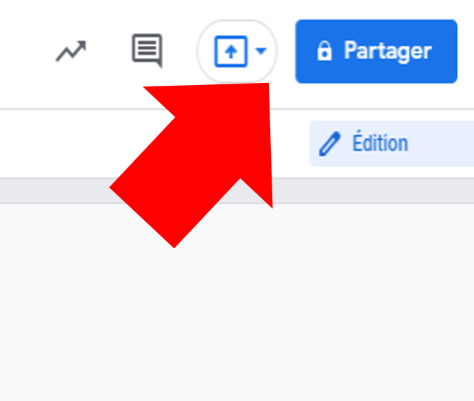
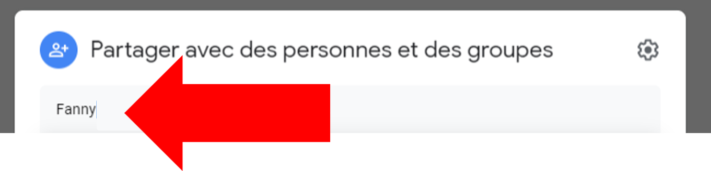
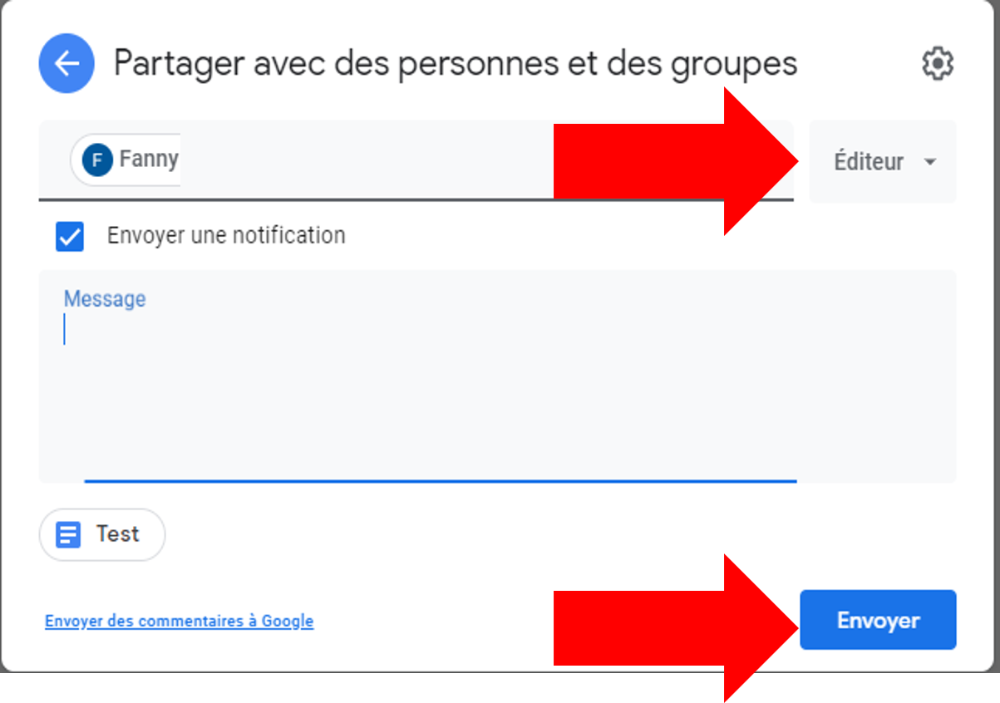

Guide pour partager un fichier dans Drive.

## 1. Ouvrir le fichier et cliquer sur « Partager »

Ouvre le fichier à partager. Le bouton bleu **Partager** se trouve en haut à
droite, au bout de la barre du haut.

## 2. Écrire le nom de la personne

Une fenêtre s'ouvre : **Partager avec des personnes et des groupes**. Écris
le nom ou l'adresse courriel de la personne dans le champ. Le Drive te
propose les noms de l'école au fur et à mesure que tu tapes — clique sur le
bon.

Tu peux en ajouter plusieurs à la suite, une après l'autre.

## 3. Choisir ce que la personne a le droit de faire

À droite du nom, un menu déroulant indique le rôle. Trois choix :

- **Lecteur** — elle peut lire, rien de plus.
- **Commentateur** — elle peut lire, commenter et proposer une
  modification, sans pouvoir faire la modification elle-même.
- **Éditeur** — elle peut tout modifier, comme toi.

Pour un travail d'équipe, c'est **Éditeur**.

## 4. Envoyer

Clique sur **Envoyer**. La personne reçoit un courriel et le fichier
apparaît dans son **Partagés avec moi**.

Tu peux décocher **Envoyer une notification** si tu ne veux pas envoyer de
courriel : le fichier sera quand même partagé.

:::attention
Donner le rôle **Éditeur** à quelqu'un, c'est lui donner le droit de tout
effacer. Dans un travail d'équipe, c'est normal de donner le droit
d'édition. En dehors de ça, demande-toi si **Lecteur** ne suffirait pas.
:::

:::astuce
Pas besoin d'ouvrir le fichier : dans le Drive, un clic droit sur le
fichier, puis **Partager**, mène exactement à la même fenêtre. Ça marche
aussi sur un dossier — et tout ce qu'il contient est alors partagé d'un
coup.
:::

:::important
Un fichier que **tu** as partagé reste dans ton Drive. Un fichier que
**quelqu'un d'autre** a partagé avec toi n'est pas dans ton Drive : il est
dans **Partagés avec moi**, dans le menu de gauche. C'est là qu'il faut
aller le chercher, pas dans « Mon Drive ».
:::

## Retirer un partage

Rouvre la fenêtre **Partager**, clique sur le rôle à côté du nom de la
personne, puis choisis **Supprimer l'accès**. Elle ne verra plus le fichier
du tout.
